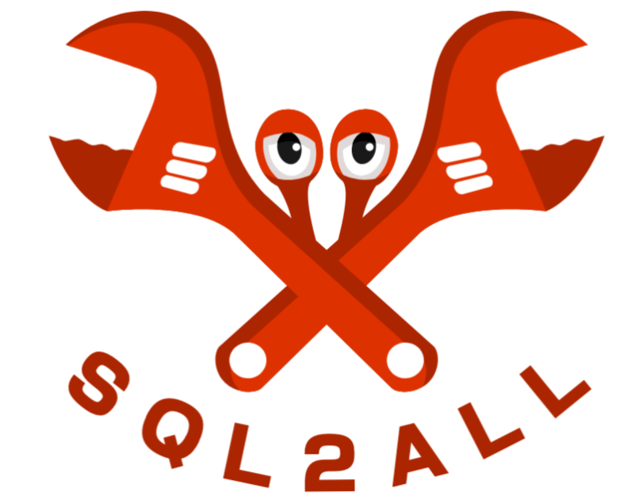

<!-- add logo -->

<p align="center">
    
</p>

# SQL2ALL

SQL2ALL is a simple tool that allows you to store your SQL queries in any format you like and then run them against any database you like. It is designed to be simple to use and easy to extend.

Support for the following databases is included:

- MySQL/MariaDB ([mysql_async](https://crates.io/crates/mysql_async))
- PostgreSQL
- SQLite

Support for the following output formats is included:

- CSV
- JSON
- Parquet

## Usage

```shell
sql2all -u <url> -o <output> -q <query>
sql2all -u "mysql://root@localhost:3306/test" -o "test.parquet" -q "select * from payment"
```
